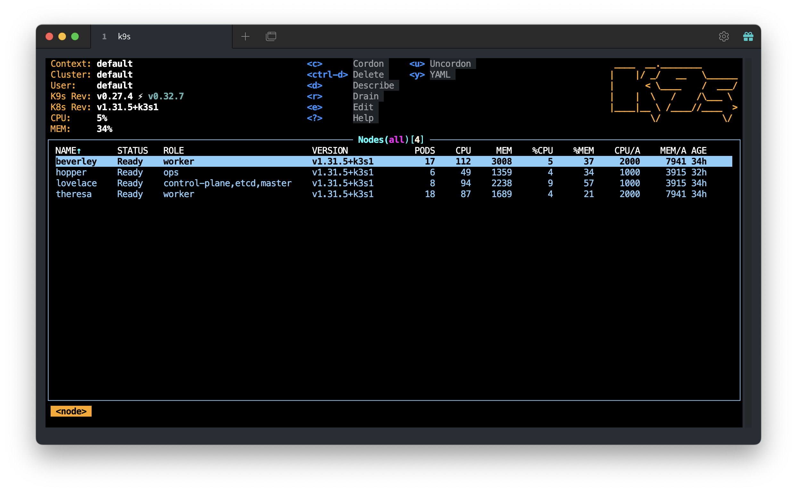

# Accessing Kubernetes

Our infrastructure runs [k3s](https://k3s.io/) which is a lightweight [Kubernetes](https://kubernetes.io/) distribution. This guide will help you get setup with accessing Kubernetes.

Most people shouldn't need to access the cluster directly. We're using the GitOps paradigm along with [Argo CD](https://argocd.zid-internal.com). Members of the [Indy-Center GitHub Organization](https://github.com/Indy-Center) should have access to Argo CD.

## Setting up Kubernetes Access

If you still need access, here are the steps you can follow:

### Install the Required Tools

First, [install `kubectl`](https://kubernetes.io/docs/tasks/tools/) on your platform of choice.

Optionally, I recommend [k9s](https://k9scli.io/) as a terminal-based tool that you can use to view the cluster.

### Update your `~/.kube/config`

The [`kubeconfig` file](https://kubernetes.io/docs/concepts/configuration/organize-cluster-access-kubeconfig/) is used to configure `kubectl` for the cluster that you wish to connect to.

You can find a copy of the `kubeconfig` file we use in [1Password]() under `Development Secrets`. **Do Not** share this file with anybody.

## Additional Links

[Argo CD](https://argocd.zid-internal.com) is a declarative, GitOps continuous delivery tool for Kubernetes.

[Grafana](https://metrics.zid-internal.com) is the open source analytics & monitoring solution for every database.
