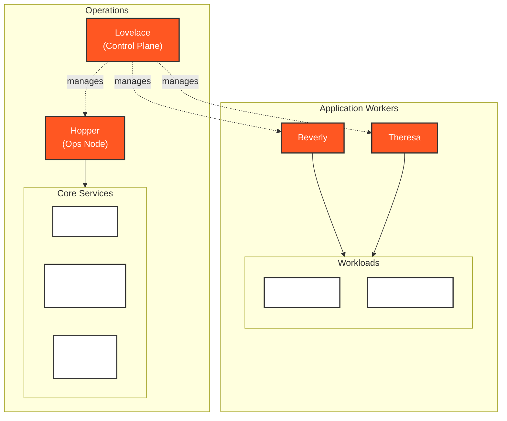

# Our Cluster

This guide covers our k3s cluster setup and commonly used commands for interacting with it.




## Cluster Overview

Our cluster runs on [k3s](https://k3s.io), a lightweight Kubernetes distribution, deployed across four nodes named after pioneering women in aviation and computer science.



### Core Components

Our cluster is managed through several key components:

<!-- prettier-ignore-start -->
!!! tip "GitOps with Argo CD"
    We use [Argo CD](../tooling/argo-cd.md) for GitOps-based deployments, automatically syncing our Git repositories to the cluster. All our infrastructure changes go through ArgoCD, ensuring consistency and traceability.

!!! abstract "Infrastructure Components"
    - **Traefik**: Built-in k3s ingress controller for routing external traffic
    - **Cert Manager**: Automatic TLS certificate management with Let's Encrypt
    - **Sealed Secrets**: Secure secret management in Git ([learn more](guides/sealed-secrets.md))
    - **Prometheus & Grafana**: Comprehensive monitoring and metrics visualization
<!-- prettier-ignore-end -->

### Node Roles

Each node in our cluster serves a specific purpose:

-   **Lovelace (Control Plane)**: Manages the cluster state, running etcd and the Kubernetes control plane
-   **Hopper (Operations)**: Dedicated to running our operational tools (ArgoCD, Prometheus, Grafana, etc.)
-   **Beverly & Theresa (Workers)**: Run our production and development workloads

## Key Concepts

Before diving into the commands, here's a quick overview of key Kubernetes concepts:

<div class="grid cards" markdown>

-   :material-server:{ .lg .middle } **Nodes**

    ***

    The foundation of your cluster - physical or virtual machines that run your workloads.

    [:octicons-arrow-right-24: Nodes docs](https://kubernetes.io/docs/concepts/architecture/nodes/)

-   :material-package:{ .lg .middle } **Pods**

    ***

    The smallest deployable units in Kubernetes. A logical host for one or more containers.

    [:octicons-arrow-right-24: Pods docs](https://kubernetes.io/docs/concepts/workloads/pods/)

-   :material-application:{ .lg .middle } **Deployments**

    ***

    Manage sets of identical pods, handling updates and rollbacks to maintain desired state.

    [:octicons-arrow-right-24: Deployments docs](https://kubernetes.io/docs/concepts/workloads/controllers/deployment/)

-   :material-network:{ .lg .middle } **Services**

    ***

    Provide stable networking for pods, giving you consistent IP addresses and DNS names.

    [:octicons-arrow-right-24: Services docs](https://kubernetes.io/docs/concepts/services-networking/service/)

-   :material-gate:{ .lg .middle } **Ingress**

    ***

    Your cluster's front door - manages external access with HTTP routing and SSL.

    [:octicons-arrow-right-24: Ingress docs](https://kubernetes.io/docs/concepts/services-networking/ingress/)

-   :material-folder-multiple:{ .lg .middle } **Namespaces**

    ***

    Virtual clusters within your physical cluster for resource organization.

    [:octicons-arrow-right-24: Namespaces docs](https://kubernetes.io/docs/concepts/overview/working-with-objects/namespaces/)

</div>

## Useful Aliases

Here are some helpful aliases to make working with our cluster easier:

=== "Bash/Zsh"

    ```bash
    # Core aliases
    alias k='kubectl'
    alias kns='kubectl config set-context --current --namespace'
    alias kgp='kubectl get pods'
    alias kgd='kubectl get deployments'
    alias klogs='kubectl logs'
    alias kexec='kubectl exec -it'
    ```

=== "PowerShell"

    ```powershell
    # Core aliases
    Set-Alias -Name k -Value kubectl
    function kns { kubectl config set-context --current --namespace=$args }
    function kgp { kubectl get pods $args }
    function kgd { kubectl get deployments $args }
    function klogs { kubectl logs $args }
    function kexec { kubectl exec -it $args }
    ```

## Common Commands

Here are the most frequently used commands for working with our cluster:

### Pods

```sh
# List pods in current namespace
kubectl get pods
# or
kgp

# Get pod logs
kubectl logs <pod-name> -f
# or
klogs <pod-name> -f

# Execute a shell in a pod
kubectl exec -it <pod-name> -- /bin/sh
# or
kexec <pod-name> -- /bin/sh
```

### Namespaces

Our cluster uses several namespaces to organize resources:

```sh
# List all namespaces
kubectl get namespaces

# Switch to a namespace
kubectl config set-context --current --namespace=<namespace-name>
# or
kns <namespace-name>
```

### Deployments

```sh
# List deployments
kubectl get deployments
# or
kgd

# View deployment details
kubectl describe deployment <deployment-name>
```

### Troubleshooting

```sh
# View pod logs in real-time
kubectl logs -f <pod-name>

# Check pod details
kubectl describe pod <pod-name>

# Port forward to a service
kubectl port-forward svc/<service-name> 8080:80
```
