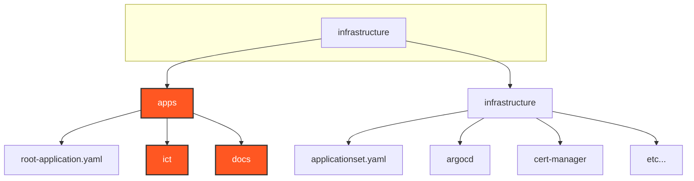
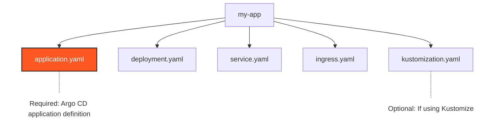

# Infrastructure Repository

Our infrastructure is managed using the [Infrastructure as Code](https://en.wikipedia.org/wiki/Infrastructure_as_code) (IaC) approach, with all configuration stored in our [infrastructure repository](https://github.com/indy-center/infrastructure).

## Repository Organization

The repository is organized into several key directories, each serving a specific purpose:



## Apps Directory

The `apps/` directory contains all our application workloads. Each application is managed through our [App of Apps pattern](https://argo-cd.readthedocs.io/en/stable/operator-manual/cluster-bootstrapping/#app-of-apps-pattern) in Argo CD.

### Root Application

The `root-application.yaml` serves as our App of Apps, automatically managing all applications in the `apps/` directory:

```yaml
apiVersion: argoproj.io/v1alpha1
kind: Application
metadata:
  name: root-application
  namespace: argocd
spec:
  project: default
  source:
    repoURL: https://github.com/indy-center/infrastructure.git
    targetRevision: HEAD
    path: apps
  destination:
    server: https://kubernetes.default.svc
    namespace: argocd
  syncPolicy:
    automated:
      prune: true
      selfHeal: true
```

### Application Structure

Each application in the `apps/` directory must include an `application.yaml` file to be deployed by Argo CD. Applications can use various configuration approaches:

-   Kubernetes manifests (plain YAML)
-   [Kustomize](https://kustomize.io/) overlays
-   [Helm](https://helm.sh/) charts

Example application structure:



Example `application.yaml`:

```yaml
apiVersion: argoproj.io/v1alpha1
kind: Application
metadata:
  name: my-app
  namespace: argocd
spec:
  project: default
  source:
    repoURL: https://github.com/indy-center/infrastructure.git
    targetRevision: HEAD
    path: apps/my-app
  destination:
    server: https://kubernetes.default.svc
    namespace: production  # or development
  syncPolicy:
    automated:
      prune: true
      selfHeal: true
```

## Infrastructure Directory

The `infrastructure/` directory contains core cluster components managed by an ApplicationSet. These components are essential for cluster operation and are deployed automatically.

### ApplicationSet

The `applicationset.yaml` manages the deployment of core infrastructure components:

```yaml
apiVersion: argoproj.io/v1alpha1
kind: ApplicationSet
metadata:
  name: infrastructure
  namespace: argocd
spec:
  generators:
  - list:
      elements:
      - name: cert-manager
      - name: argocd
      # Add other infrastructure components
  template:
    metadata:
      name: '{{name}}'
    spec:
      project: default
      source:
        repoURL: https://github.com/indy-center/infrastructure.git
        targetRevision: HEAD
        path: infrastructure/{{name}}
      destination:
        server: https://kubernetes.default.svc
        namespace: '{{name}}'
      syncPolicy:
        automated:
          prune: true
          selfHeal: true
```

## Environments

We maintain two primary environments:

-   `production` namespace
-   `development` namespace

### Domain Configuration

All applications can utilize our wildcard domains:

-   Production: `*.zid-internal.com`
-   Development: `*.dev.zid-internal.com`, `*.next.zidartcc.org`

Example ingress configuration:

```yaml
apiVersion: networking.k8s.io/v1
kind: Ingress
metadata:
  name: my-app
  namespace: production  # or development
  annotations:
    cert-manager.io/cluster-issuer: letsencrypt-prod
spec:
  rules:
  - host: my-app.zid-internal.com  # or my-app.dev.zid-internal.com
    http:
      paths:
      - path: /
        pathType: Prefix
        backend:
          service:
            name: my-app
            port:
              number: 80
  tls:
  - hosts:
    - my-app.zid-internal.com
    secretName: my-app-tls
```

## Best Practices

1. **Application Structure**

    - Always include an `application.yaml` in each `app` directory.
    - Use consistent naming across resources
    - Group related resources in the same directory

2. **Environment Management**

    - Use the appropriate namespace for your environment
    - Follow the domain naming convention for ingress resources
    - Keep environment-specific configuration in separate files

3. **Infrastructure Components**
    - Core components should be added to the ApplicationSet
    - Follow component-specific documentation for configuration
    - Test changes in development before applying to production

## Additional Resources

-   [Argo CD App of Apps Pattern](https://argo-cd.readthedocs.io/en/stable/operator-manual/cluster-bootstrapping/#app-of-apps-pattern)
-   [Argo CD Application Specification](https://argo-cd.readthedocs.io/en/stable/operator-manual/application.yaml)
-   [Kubernetes Best Practices](https://kubernetes.io/docs/concepts/configuration/overview/)
